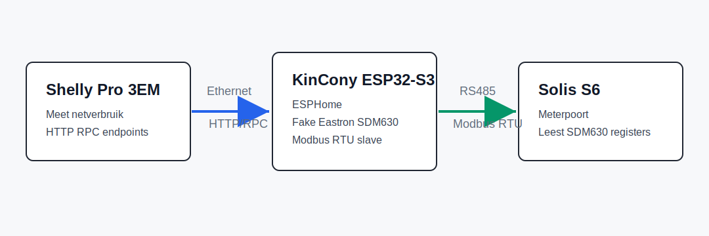

# Solis Shelly SDM630 Bridge

Use a Shelly Pro 3EM as the grid meter for a Solis S6 inverter that normally expects an Eastron SDM630MCT over Modbus RTU.

The bridge runs on a KinCony ESP32-S3 Core Board. The ESP reads the Shelly over HTTP/RPC and presents itself to the Solis inverter as an Eastron/SDM630 Modbus RTU slave over RS485.

## Status

Tested with:

- Solis S6 inverter with an Eastron/SDM630 meter port
- Shelly Pro 3EM / EM3 with RPC endpoints
- KinCony ESP32-S3 Core Board with onboard W5500 Ethernet and RS485
- ESPHome 2026.4.x

## Hardware

- KinCony ESP32-S3 Core Board
- 12 V power supply for the KinCony
- Shelly Pro 3EM or compatible Shelly Gen2/Gen3 energy meter
- Ethernet cable
- RJ45 plug or cable for the Solis meter port
- The meter-port cable supplied with the Solis inverter can be reused
- ESPHome Device Builder

## Wiring

Use the onboard RS485 terminal on the KinCony and connect it to the Solis meter port.

| KinCony onboard RS485 | Solis meter RJ45 | Function |
| --- | --- | --- |
| 485A | Pin 1 | RS485 A |
| 485B | Pin 2 | RS485 B |
| GND | Only if available | Reference, usually not required |

If you have the original Solis meter cable, plug the RJ45 side into the Solis meter port and connect the RS485 A/B wires on the other end to the KinCony. Check continuity to identify pin 1 and pin 2 if the wire colors are unclear.

If the Solis inverter does not detect a meter, swap A and B. RS485 labels are not always consistent across devices.

## Quick Start

1. Create DHCP reservations for the Shelly and, optionally, the KinCony.
2. Copy `esphome/solis-sdm630-bridge.yaml` into ESPHome.
3. Change `shelly_host` at the top of the YAML to your Shelly IP or hostname.
4. Flash the KinCony over USB for the first install.
5. Connect the KinCony RS485 terminal to the Solis meter port.
6. Configure the Solis meter as Eastron/SDM630, Modbus address `1`, `9600 8N1`.
7. Check the ESPHome logs and confirm Shelly values arrive every second.
8. Check the Solis display for live meter/grid values.

More detail is available in [docs/installation.md](docs/installation.md).

## ESPHome Configuration

The complete example configuration is here:

- [esphome/solis-sdm630-bridge.yaml](esphome/solis-sdm630-bridge.yaml)

Important settings:

- Modbus slave address: `1`
- Baudrate: `9600`
- UART: `GPIO16` TX and `GPIO15` RX for the KinCony onboard RS485
- DHCP: no static IP is configured in the YAML
- Shelly polling: once per second through `/rpc/EM.GetStatus?id=0`

## Safety

Do not work on wiring while the inverter or electrical cabinet is energized. RS485 is low voltage, but the meter and CT wiring are close to mains voltage. Have the mains side checked by a qualified person.

## Documentation

- [Installation guide](docs/installation.md)
- [Troubleshooting](docs/troubleshooting.md)
- [Register mapping](docs/register-mapping.md)
- [RJ45 pinout](assets/rj45-meter-pinout.svg)
