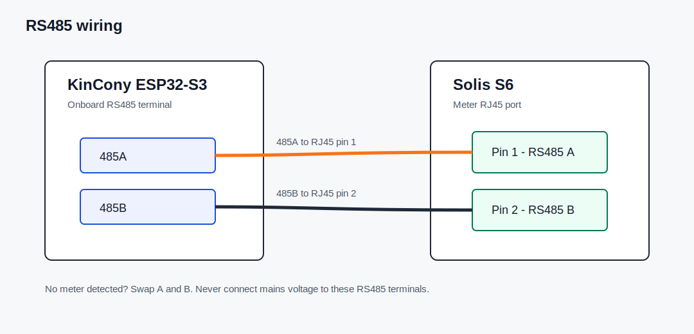

# Installation Guide

This guide describes the tested path: Shelly to ESPHome over Ethernet, then ESPHome to Solis over RS485.

## 1. Prepare the Network

Use DHCP. Create DHCP reservations in your router for:

- Shelly energy meter
- KinCony ESP32-S3 Core Board

The ESPHome YAML intentionally does not contain a static IP. If mDNS later causes OTA issues, you can temporarily use `use_address` with the reserved DHCP address.

## 2. Check the Shelly

Check in a browser that the Shelly RPC endpoints respond:

```text
http://SHELLY_IP_OR_HOSTNAME/rpc/EM.GetStatus?id=0
http://SHELLY_IP_OR_HOSTNAME/rpc/EMData.GetStatus?id=0
```

The first response should contain fields such as `a_act_power`, `b_act_power`, `c_act_power`, `total_act_power`, voltage and current.

## 3. Add the ESPHome YAML

Copy:

```text
esphome/solis-sdm630-bridge.yaml
```

into ESPHome and change the substitution at the top:

```yaml
substitutions:
  shelly_host: shelly-pro-3em.local
```

to the IP address or hostname of your Shelly.

## 4. Flash the KinCony

Flash the KinCony over USB for the first install. After that, OTA over Ethernet can be used.

After flashing, check:

- ESPHome API is online
- The web server works at `http://KINCONY_DHCP_IP/`
- `Shelly EM Online` is on
- Shelly phase power values update every second

## 5. Connect RS485



| KinCony | Solis RJ45 meter port |
| --- | --- |
| 485A | Pin 1 |
| 485B | Pin 2 |

You can reuse the meter-port cable supplied with the Solis inverter. Plug the RJ45 side into the Solis meter port and connect the RS485 A/B wires on the other end to the KinCony. If the wire colors are unclear, use a continuity tester to identify RJ45 pin 1 and pin 2.

Prefer a short twisted pair cable. GND is usually not required, but can be connected if both devices provide a low-voltage reference for it.

## 6. Configure the Solis

Use the meter settings for an Eastron SDM630/SDM630MCT:

- Meter type: Eastron / SDM630
- Protocol: Modbus RTU
- Address: `1`
- Baudrate: `9600`
- Data: `8N1`

Exact menu names differ between Solis firmware versions.

## 7. Verification

In ESPHome logs, you should see lines similar to these every second:

```text
Shelly Phase A Power
Shelly Phase B Power
Shelly Phase C Power
Shelly Total Active Power
```

On the Solis display, live meter/grid values should be visible. Home Assistant or SolisCloud integrations may refresh more slowly or periodically; the Solis display is the fastest confirmation.

